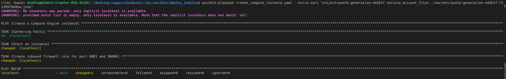

<!-- Improved compatibility of back to top link: See: https://github.com/othneildrew/Best-README-Template/pull/73 -->
<a id="readme-top"></a>


<!-- ABOUT THE PROJECT -->
## About The Project

This project aims to generate synthetic data for translating English quotes into Vietnamese using the Gemini API. The generated data serves as the foundation for fine-tuning the Gemma-2b model, enhancing its ability to produce high-quality Vietnamese quotes. The ultimate goal is to deploy the model and make it production-ready and highly scalable using Kubernetes on Google Cloud Platform (GKE) and integrate with CI-CD pipeline. This is my first project of MLOps course 1 at [FSDS](https://www.fullstackdatascience.com/). I'd like to give a big credit to my instructor [Mr. Quan Dang](https://www.linkedin.com/in/quan-dang/) for his guidance and support.


<p align="right">(<a href="#readme-top">back to top</a>)</p>


### Built With

* [![Gemini API][Gemini-logo]][Gemini-url]
* [![Unsloth][Unsloth-logo]][Unsloth-url]
* [![VLLM][vllm-logo]][vllm-url]
* [![FastAPI][FastAPI-logo]][FastAPI-url]
* [![Docker][Docker-logo]][Docker-url]
* [![GCP][gg-cloud-logo]][gg-cloud-url] [![GKE][GKE-logo]][GKE-url]
* [![Ansible][Ansible-logo]][Ansible-url]
* [![Terraform][Terraform-logo]][Terraform-url]
* [![Ngnix][Ngnix-logo]][Ngnix-url]
* [![Elasticsearch][Elasticsearch-logo]][Elasticsearch-url] [![Logstash][Logstash-logo]][Logstash-url] [![Kibana][Kibana-logo]][Kibana-url]
* [![Prometheus][Prometheus-logo]][Prometheus-url] [![Grafana][Grafana-logo]][Grafana-url]
* [![Jaeger][Jaeger-logo]][Jaeger-url]
* [![Jenkins][Jenkins-logo]][Jenkins-url]

<p align="right">(<a href="#readme-top">back to top</a>)</p>


<!-- GETTING STARTED -->
## Getting Started

This is an example of how you may give instructions on setting up your project. If you don't want to fine-tune the model, you can skip the <a href="#dg">data generation section</a> and <a href="#training">training section</a> and move ahead to the <a href="#deployment">deployment section</a>. Checkout my data and model on the Huggingface hub as prequisites for the deployment phase.:
- Dataset: [dinhlnd1610/Vietnamese_Quote_Dataset_100K](https://huggingface.co/datasets/dinhlnd1610/Vietnamese_Quote_Dataset_100K)
- Model: [dinhlnd1610/gemma-2b-quote-generation-82000](https://huggingface.co/dinhlnd1610/gemma-2b-quote-generation-82000)

### General Setup

1. Clone the repository
   ```sh
   git clone https://github.com/dinhln03/LLM_Quote_Genarator.git
   ```
2. Cd into the project directory
   ```sh
   cd LLM_Quote_Genarator
   ```
3.  Run `export ROOT_DIR=$(pwd)` for easier nagivation


### I. Data Generation

1. Setup
   - Install [conda](https://docs.conda.io/projects/conda/en/latest/user-guide/install/index.html) for managing Python environments
   - Install [gdown](https://github.com/wkentaro/gdown)
2. ```sh
   cd $ROOT_DIR/training/translate
   ```
3. Create new .env file based on .env.example at `$ROOT_DIR/training/translate` path and populate the variables there
   ```sh
   set -a && source .env && set +a
   ```
4. Download English quote dataset and install the required packages
   ```sh
   gdown https://drive.google.com/uc?id=11MmVMc0khvB94W0zqDyUHowEEG650BSX
   conda create -n training python=3.10 -y && conda activate training  && pip install -r requirements.txt
   ```
5. Run the Script to generate Vietnamese quotes. Data will be saved in `data` folder and log will be saved in `logs` folder
   ```bash
   python run.py main \
     --data_path=$data_path \
     --sample_length=$sample_length \
     --start_batch=$start_batch \
     --end_batch=$end_batch \
     --num_thread=$num_thread
   ```
   ```bash
   # Example
   python run.py main --data_path=./data.csv --sample_length=20000 --start_batch=0 --end_batch=4000 --num_thread=5
   ```
   | Parameter | Description |
   |-----------|-------------|
   | `$data_path` | Path to the downloaded English quote dataset |
   | `$sample_length` | Number of quotes to translate |
   | `$start_batch` | Starting batch number |
   | `$end_batch` | Ending batch number |
   | `$num_thread` | Number of threads to use |

   **Key Notes:**
   - You should choose `num_thread` such that `(end_batch - start_batch + 1)` is divisible by `num_thread`.
    - Calculate `num_thread` using:
      ```sh
      num_thread = (end_batch - start_batch) // 5
      ```
6. Merge json data in folder `data` to a single json file
   ```bash
   python utils/merge_file.py 
   ```
7. Checkout the notebook to do some preprocessing data step such as: removing duplicate data point, remove toxic words,.. and push to huggingface hub. You can include more preprocessing steps such as removing more toxic words, filtering by perplexity,...

<a id="training"></a>
<p align="right">(<a href="#readme-top">back to top</a>)</p>

### II. Fine-tuning Gemma-2b model
1. Install the required packages
   ```sh
   cd $ROOT_DIR/training/training_scripts
   sh run.sh
   ```

2. Download google/gemma-2b model on huggingface hub and write appropriate chat template for generating quotes
   ```sh
   cd utils
   python training_utils.py download_model google/gemma-2b ../../gemma-2b
   ```

3. Fine-tune gemma-2b model on translated data produced in the previous step
   ```bash
   cd $ROOT_DIR/training/training_scripts
   ```
   **If you have only 1 GPU**, just run
   ```bash
   export CUDA_VISIBLE_DEVICES=0
   python training.py
   ```
   **If you have 1 node and multiple GPUs**, run Distributed Data Parallel
   ```bash
   export CUDA_VISIBLE_DEVICES=1,2,...
   torchrun --standalone --nnodes=1 --nproc-per-node=$NUM_GPUs training.py
   ```

4. Login to Wandb to monitor the training process
   
   

5. Merge the lora adapter with the base model. 
   ```bash
   cd utils
   python training_utils.py merge_model \
      --base_model_path=$base_model_path \
      --lora_path=$lora_model_path \
      --output_path=$output_model_path
   ```
   | Parameter | Description |
   |-----------|-------------|
   | `$base_model_path` | Path to the orginal google/gemma2b model |
   | `$lora_model_path` | Path to the fine-tuned lora adapter |
   | `$output_model_path` | Path to save the merged model |

6. Checkout the notebook to push the model to huggingface hub. 
<p align="right">(<a href="#readme-top">back to top</a>)</p>


<a id="deployment"></a>

### III. Deployment

1. Setup
   - Install [kubectl](https://kubernetes.io/vi/docs/tasks/tools/install-kubectl/) to communicate with the Kubernetes API server
   - Install [kubectx and kubens](https://github.com/ahmetb/kubectx) for easier navigation between clusters and namespaces
   - Install [helm](https://helm.sh/docs/intro/install/) to manage templating and deployment of Kubernetes resources
   - Install yq to edit YAML files
      ```shell
      sudo wget https://github.com/mikefarah/yq/releases/latest/download/yq_linux_amd64 -O /usr/bin/yq && sudo chmod +x /usr/bin/yq && hash -r
      ```
   - Create a new `.env` file based on `.env.example` and populate the variables there
      ```sh
      cd $ROOT_DIR
      set -a && source .env && set +a
      ```

2. Deploy model on RunPod

   **Note:** You need to have a RunPod account and push the model to the huggingface hub first

   - Log in and click on Serverless tab
     

   - In the Serverless vLLM tab, choose start
     
   - Config path to your model and other configurations properly
     
   - Follow this [tutorial](https://docs.runpod.io/tutorials/serverless/gpu/run-gemma-7b#interact-with-your-model) to get $RUNPOD_ENDPOINT_ID, $RUNPOD_API_KEY and $HF_MODEL_NAME and populate them into .env file

3. - Containerize the FastAPI app using Docker:
   ```shell
   docker build -t quote-generator:lastest -f Dockerfile .
   ```
   - Quick test the container:
   ```shell
   docker run -p 30000:30000 quote-generator:lastest
   ```
   - Access the FastAPI app at `http://localhost:30000/docs` and test the API
      

   - Rename the image to your Docker Hub username and push it to Docker Hub (remenber to login to Docker Hub first):s
   ```shell
   docker tag quote-generator:lastest$DOCKER_USERNAME/quote-generator:lastest
   docker push $DOCKER_USERNAME/quote-generator:lastest
   ```

   Cool! Now you have a FastAPI app running in a container. Let's "go to the moon" and deploy it to the cloud with K8s. 

4. Creating GKE cluster using Terraform
   - Login to GCP console and create new project
      
   - Input your project ID in in variable "project_id" in `terraform/variables.tf`

      
      
   - Login to GCP using gcloud CLI
      ```shell
      gcloud auth application-default login
      ```
   - Provision a new GKE cluster using Terraform
      ```shell
      cd $ROOT_DIR/iac/terraform
      terraform init
      terraform plan
      terraform apply
      ```
      
   - Connect to the GKE cluster
      ```shell
      gcloud container clusters get-credentials $CLUSTER_NAME --region $REGION --project $PROJECT_ID
      ```
   That's it! You have a GKE cluster up and running. In case you want to delete the cluster, just run `terraform destroy`. 

5. Deploy the FastAPI app to GKE (remember to change the image in the `quote_gen_chart/values.yaml` file to your Docker Hub username)
   - Switch context to the GKE cluster
      ```shell
      kubectx gke_${PROJECT_ID}_${REGION}_${CLUSTER_NAME}
      ```
   - Install nginx-ingress controller
      ```shell
      cd $ROOT_DIR/helm/nginx-ingress
      helm upgrade --install nginx-ingress . --namespace nginx-ingress --create-namespace
      ```
   - Get the external IP of the nginx-ingress controller
      ```shell
      export EXTERNAL_IP=$(kubectl get svc -n nginx-ingress | grep "LoadBalancer" | awk '{print $4}')
      ```
      
   - Create Host for the external IP and export it as env variable. Here, I use nip.io for dynamic DNS ( You can use your own domain or append new host to /etc/hosts that point to the external IP)
      ```shell
      export HOST=app.$EXTERNAL_IP.nip.io
      ```
   - Install quote-generator appplication
      ```shell
      cd $ROOT_DIR/helm/quote_gen_chart
      yq e '.host = env(HOST)' -i values.yaml
      helm upgrade --install quote-generator . --namespace quote-gen --create-namespace
      ```
   - Now can can access the FastAPI swagger UI at `<HOST>/docs`
   
<p align="right">(<a href="#readme-top">back to top</a>)</p>


### IV. Observability

So far, we have deployed the model and the FastAPI app to GKE. Now, we need to monitor the performance of the model and the app. We will use Prometheus and Grafana for monitoring the model and the app, Jaeger for tracing the requests and Elastic Search and Kibana for collecting system logs. Let's cook !

1. Increase inotify watch limits to Kubernetes instances.
   ```shell
   cd $ROOT_DIR/observability/inotify
   kubectl apply -f inotify-limits.yaml
   ```

2. Create a separate namespace for observability and switch to it
   ```shell
   kubectl create namespace observability
   kubens observability
   ```

3. Install Jaeger for tracing application
   ```shell
   cd $ROOT_DIR/observability/jaeger
   yq e '.query.ingress.hosts = [env(HOST)]' -i values.yaml
   helm upgrade --install jaeger . --namespace observability 
   ```

4. Install ELK stack for collecting logs
   ```shell
   # Intall ECK operator
   cd $ROOT_DIR/observability/elasticcloud/deploy/eck-operator
   kubectl delete -f https://download.elastic.co/downloads/eck/2.13.0/crds.yaml
   kubectl create -f https://download.elastic.co/downloads/eck/2.13.0/crds.yaml
   kubectl apply -f https://download.elastic.co/downloads/eck/2.13.0/operator.yaml
   #Install ELK stack
   cd $ROOT_DIR/observability/elasticcloud/deploy/eck-stack
   kubectl get serviceaccount filebeat -n elk &> /dev/null && kubectl delete serviceaccount filebeat -n elk || true
   kubectl get clusterrolebinding filebeat -n elk &> /dev/null && kubectl delete clusterrolebinding filebeat -n elk || true
   kubectl get clusterrole filebeat -n elk &> /dev/null && kubectl delete clusterrole filebeat -n elk || true
   helm upgrade --install elk -f values.yaml .
   ```

5. Install Prometheus + Grafana for monitoring system
   ```shell
   cd $ROOT_DIR/observability/metric
   yq e '.data."config.yml" |= sub("webhook_url: .*", "webhook_url: env(DISCORD_WEBHOOK_URL)")' -i charts/alertmanager/templates/configmap.yaml 
   helm upgrade --install prom-graf . --namespace observability
   ```

6. Access the monitoring tools:
   - Jaeger: `<HOST>/tracing-jaeger`
   
   
   

   - Kibana: 
      ```shell
      nohup kubectl port-forward -n observability svc/elk-eck-kibana-kb-http 5601:5601 > /dev/null 2>&1 &
      ```
      
      Access Kibana at `http://localhost:5601`
      

      Get the password for the `elastic` user by running:
      ```shell
      kubectl get secret elasticsearch-es-elastic-user -n observability -o jsonpath='{.data.elastic}' | base64 -d
      ```

      Login and check for logs
      

   - Grafana: 
      ```shell
      nohup kubectl port-forward -n observability svc/grafana 3000:3000 > /dev/null 2>&1 &
      ```

      Access Grafana at `http://localhost:3000`
      

      Login with `username: admin and password: admin` and check for metrics
      
      
      
   
   - Alertmanager: You will receive alerts in your Discord channel
      
<p align="right">(<a href="#readme-top">back to top</a>)</p>


### V. CI-CD Pipeline
So far, we have deployed the model and the FastAPI app to GKE, monitored the performance of the model and the app. Now, we need to automate the deployment process using Jenkins. Let's do it !
1. Setup
   - Rebuild Jenskin image with docker and helm installed
      ```shell
      cd $ROOT_DIR/custom_images/jenkins
      docker build -t $DOCKER_USERNAME/jenkins:lts -f Dockerfile .
      ```
   - Push the image to Docker Hub (remember to login to Docker Hub first)
      ```shell
      docker push $DOCKER_USERNAME/jenkins:lts
      ```
2. Build up a VM instance on GCP using Ansible
   - Install pre-requisites
      ```shell
      cd $ROOT_DIR/iac/ansible/deploy_jenkins
      pip install -r vm_requirements.txt
      ```
   - Create a Service Account on GCP and download the JSON key file. Then put the file in the `iac/ansible/secrets` folder
      
   - Build up the VM instance
      ```shell
      ansible-playbook deploy_jenkins.yml --extra-vars "project=$PROJECT_ID service_account_file=$secret_file_path"
      ```
      For example: `ansible-playbook create_compute_instance.yaml --extra-vars "project=quote-generation-442617 service_account_file=../secrets/quote-generation-442617-f1139970a9ba.json"`

      

      You have successfully created a VM instance on GCP. Now, let's install Jenkins on it.
      
3. Install Jenkins on VM 
   - Create a new ssh key pair
      ```shell
      mkdir $ROOT_DIR/iac/ansible/.ssh
      ssh-keygen -f $ROOT_DIR/iac/ansible/.ssh/jenkins 
      ```
   - Cat the public key and add it to the VM instance
      ```shell
      cat $ROOT_DIR/iac/ansible/.ssh/jenkins.pub
      ```
   - Get your VM's external IP address and add it to the `iac/ansible/inventory` file
   - Install Jenkins on the VM
      ```shell
      ansible-playbook -i ../inventory deploy_jenkins.yaml
      ```
      

3. Access Jenkins at `http://<VM_IP_ADDR>:8081` and find password by running
   ```shell
   ssh -i $ROOT_DIR/iac/ansible/.ssh/jenkins <username>@<VM_IP_ADDR>    # Example: ssh -i $ROOT_DIR/iac/ansible/.ssh/jenkins dinhln@35.240.163.52
   sudo docker exec -it jenkins cat /var/jenkins_home/secrets/initialAdminPassword
   ctrl + D  # to exit the ssh session
   ```
   
4. Install the recommended plugins and create an admin user
   
5. Choose `Skip and continue as admin` and `Save and finish`
6. Choose `Start using Jenkins`
7. We will be redirected to the Jenkins dashboard
   
8. Choosing manage Jenkins -> Manage plugins -> Available -> Search for `Docker` and `Kubernetes` and install them
   

9. Connect Jenkins to GKE cluster
   - Choose `Manage Jenkins` -> `Cloud` -> `New Cloud` 
      
   - Get cluster ip and put it in the `Kubernetes URL` field
      ```shell
      current_context=$(kubectl config current-context)
      current_cluster=$(kubectl config view -o jsonpath="{.contexts[?(@.name=='$current_context')].context.cluster}")
      kubectl config view -o jsonpath="{.clusters[?(@.name=='$current_cluster')].cluster.server}"
      ```
   - Get the server certificate and put it in the `Kubernetes server certificate key` field
      ```shell
      current_context=$(yq e '.current-context' ~/.kube/config)\
      current_cluster=$(yq e ".contexts[] | select(.name == \"$current_context\") | .context.cluster" ~/.kube/config)\
      yq e ".clusters[] | select(.name == \"$current_cluster\") | .cluster.\"certificate-authority-data\"" ~/.kube/config
      ```
   - Grants admin privileges to the "default" service account in that quote-gen namespace, and also grants admin privileges to anonymous users within the same namespace.
      ```shell
      kubectl create clusterrolebinding model-serving-admin-binding \
      --clusterrole=admin \
      --serviceaccount=model-serving:default \
      --namespace=quote-gen

      kubectl create clusterrolebinding anonymous-admin-binding \
      --clusterrole=admin \
      --user=system:anonymous \
      --namespace=quote-gen
      ```
   - Test connection
      

10. Create a new pipeline
   - Choose `New Item` -> `Multi Branch Pipeline` -> `OK`

      

   - Configure the pipeline

      

      
   - Add Docker Hub credentials

      

      

      

      

11. Finally, add new webhook to your Github Reposistory
   - Go to your Github repository -> Settings -> Webhooks -> Add webhook
   - Add the Jenkins URL and append `/github-webhook/` to it
   - Choose `Push and Pull Request` and `Active` the webhook
   - Save the webhook
   
   
12.Demo 
   
   
<p align="right">(<a href="#readme-top">back to top</a>)</p>


<!-- MARKDOWN LINKS & IMAGES -->
[GKE-logo]: https://img.shields.io/badge/GKE-blue?logo=data:image/png;base64,iVBORw0KGgoAAAANSUhEUgAAAFAAAABQCAMAAAC5zwKfAAAAh1BMVEVHcExBhPJChfRChfRAgu9BhPJChfRBg/FBg/BChfRChfRBhPJBhPI9fONAg/BChfRChfRBg/BAgu49fOM9fONChfQ9fOP///87e+OMsvA9feRAhPRAge7c6Puwy/j2+f5vn+xJhOVflOvr8v2hwPKbvPLN3fn7/P9CgOR5pvFTi+e/1PimxPZirr5pAAAAFXRSTlMAFticDwXsskXJ93cq14lW3zZk7p45DTruAAADv0lEQVRYw+2Y2ZKqMBCGdRBQGR03YmTRgIICvv/znYQQlpCNKa+mTtdcUE7x2Xb+9J/0bPY/6rAXc20sbHPc0lp9aWNlLQ2Rc2vtG8XamhvxXN84XBPi1p8QWz1v70wB7vY63sLyJ4WlW5if9TTg+keT4MqfCFwtlEDPnxwHFe/7azrw6/tTkjGQzjTJsHCk0lm4/q/CtT8kGZ105iv/l7Gaf0oyLEVPKJmd4pWw/psmHeUmLqqqUCG343VZOvLsUHU7n28VkiOdpblkwvR9P5N43t+plOjyW/qwlqV3iTHs9nziJM/xRZYkLx2JZEK/yJ84t7yIY/YkQXLSEUomDNMrzStJ4jhJaK7XNBQiPa1kwjQjxbs/SggJEMLyUX+QCUu560nHtuTFq1IAAQXih7SSl7LnBgLJhEWFS3bOixcEgAHxw6vIyYJjCSmkI5BMWNxp8QgFQJjGcQrpMy3lvQjl0hFIJnzjd95ln9HRSyLMLBpL5yCXTHjFrwAKeCEiGCIZ9KKfgAz/F0Yy6Yj6PgFe6rcDKp06sGSCmnghwCASS2e/UwEhis+9iBFsgWBMJNKxhV2mBb7oGjDeJXl1QAERS+fHUQHhJUuonKnEk4x+SoFjIpaOuMu0wAeRYl1GXEAiwkcfOCa6M0cHJJsFkwiXbJMhcER0Zr4WWCsySUraFjngiGgExKuRps3a8ECeONsZAZ8IPSXAIdGReBMPvCF0kwEHREusawaE4M0D36SbDYE9Iuk4nhwIWwl2wLrfcsCOSOxUaCc1kGyS+HrvA+/XmGwXHsiI1PBFhkeAVY67fQmoqmsg1jYosS/kFQ9siJ7Ukgmwfh/S9kVWmbYvSL+BB9ZE5nwiByCLkfeaNEK99p0LgJjYerOg4fAWQHbK0AIQDwSgcymRi6KK+jpr0qx9U7+vUDDiHfcan6/9jdaxCVY/9jWDgFvdSSQqO6Nvfnhj9OUYB8Bmrj0rRaA9isC2eDhlKOKBg8FpLoJBU0oUBIgVT4gD/HlOfN6Murx6uQoCHvkTp9ir/CjAlcuYp2Sl+NfiONmGZ/YoYGs7WG+VZDS3Ckwku6+q0EuKA8CbcO8hRIxU4TjJ6G5mUQB0cZh2d9QRoSu51UuvKhriSDL6y5SaeJJORuTXPRVx8/2bGYacCD3V3Gs1nbhRzb9sxaVeQjwe1IMgxdhBTHTVgyDFLVdMlEtG3XWkxJN2yqmcFIyIKskYzTJ4omcw4VRPEIfE08JkCLvYOmbE49aIpx07b5o4Lc0n2bPPDsb/ePwDZQ+HUK8kuT0AAAAASUVORK5CYII=
[GKE-url]: https://cloud.google.com/kubernetes-engine
[Docker-logo]: https://img.shields.io/badge/Docker-blue?logo=docker
[Docker-url]: https://www.docker.com/
[Gemini-logo]: https://img.shields.io/badge/GeminiAPI-blue?logo=googlegemini
[Gemini-url]: https://ai.google.dev/
[Unsloth-logo]: https://img.shields.io/badge/Unsloth-green?logo=data:image/jpeg;base64,/9j/4AAQSkZJRgABAQEAMgAyAAD/4gHYSUNDX1BST0ZJTEUAAQEAAAHIAAAAAAQwAABtbnRyUkdCIFhZWiAH4AABAAEAAAAAAABhY3NwAAAAAAAAAAAAAAAAAAAAAAAAAAAAAAAAAAAAAQAA9tYAAQAAAADTLQAAAAAAAAAAAAAAAAAAAAAAAAAAAAAAAAAAAAAAAAAAAAAAAAAAAAAAAAAAAAAAAAAAAAlkZXNjAAAA8AAAACRyWFlaAAABFAAAABRnWFlaAAABKAAAABRiWFlaAAABPAAAABR3dHB0AAABUAAAABRyVFJDAAABZAAAAChnVFJDAAABZAAAAChiVFJDAAABZAAAAChjcHJ0AAABjAAAADxtbHVjAAAAAAAAAAEAAAAMZW5VUwAAAAgAAAAcAHMAUgBHAEJYWVogAAAAAAAAb6IAADj1AAADkFhZWiAAAAAAAABimQAAt4UAABjaWFlaIAAAAAAAACSgAAAPhAAAts9YWVogAAAAAAAA9tYAAQAAAADTLXBhcmEAAAAAAAQAAAACZmYAAPKnAAANWQAAE9AAAApbAAAAAAAAAABtbHVjAAAAAAAAAAEAAAAMZW5VUwAAACAAAAAcAEcAbwBvAGcAbABlACAASQBuAGMALgAgADIAMAAxADb/2wBDAAMCAgMCAgMDAwMEAwMEBQgFBQQEBQoHBwYIDAoMDAsKCwsNDhIQDQ4RDgsLEBYQERMUFRUVDA8XGBYUGBIUFRT/2wBDAQMEBAUEBQkFBQkUDQsNFBQUFBQUFBQUFBQUFBQUFBQUFBQUFBQUFBQUFBQUFBQUFBQUFBQUFBQUFBQUFBQUFBT/wAARCAA8ADwDASIAAhEBAxEB/8QAHQAAAQUAAwEAAAAAAAAAAAAACAAFBgcJAQIEA//EADYQAAEDAwMCBAMGBQUAAAAAAAECAwQFBhEABxIIITFBUWETcYEJFBYiMlIVM0JioUSDkbHB/8QAGwEAAQUBAQAAAAAAAAAAAAAAAgABAwUGBwT/xAArEQABAwMCBQMEAwAAAAAAAAABAAIRAwQFITEGEhNRcUFhgRQWkaFCwfD/2gAMAwEAAhEDEQA/ANU9LS1WO8O77dhRxT6fwfrbyOQ5d0x0nwUoeZPkPqfdwJXju7ujY0TXrmGj/QPdT2tXFS7cj/HqdQjwWz4F9wJKvkPE/TUJldQVkxllP8SddA/qbjOY/wAgaF9x6tXtUZUpbjtQkNoLsmZKdCW2UDxUtxRCW0D3IA1WF1b1bR2oX0Vnd2gF1kEqj0VmTUVqP7UKbb+Eo/7gHvo+UDcrA/cOVviTjraW9zr+5AR+0Te6ya++liPX47L6uwblhTBJ9AVgAn5HU4SoLSFJIUkjII8DrMezbhtre+yp9y7b1KpVtimyjGn0+fEaYmNJ4hQkBlt5xXwe+OSgO48++LC2d6hq7tlNZiynnarbxIS5CdXyUyP3NE/pI/b4H28dPySJaomcXXGPuhaZqh05/kNR53MjuQdOyPfS032/X4F0UaJVaZITKgymw406nzB9fQjwI8iNOGol01rmvaHtMg7JuuOts23QahVZH8mGwt5Qz48RnH18ProFX6vUdxLzS38VK6hVJP5nFnCEZPcn0SkZPsBoouqOouU7ZmrlskF51hpRHoXUk/8AWgRrtal0PaDdmtQg4alGteRGhloEuJdlOtRAUY78sPqxjvk6lboCVyrieq+9zFriQYaYJ+SZ/AGnlURupuNfXWfuU/tTs2w5+A6StSgpbwjMS+B4qnzXSQMKV+hJzxBSEp5ZzEN9/s1N2tj7GauWqLgXCkNyZc5NCLjrFPisthanXnnEoAJzhKQDywcHtjUI6PumW69/rqk1O2qFRLwjW0+xJqNtVaqGEZrairiMjvwykgkEY7Dz1qrstOuTZLaO2Ntrms+PuDLrtzyKJWKBb0n71AtWJIbS8IrgeK1LZbZdCuKiQELI5EBOYl1KlSZQYKVMQ0aALJW5dj94+lyn2PuWYtQt6LWIjFUpVfpbqsMfESFoadUn+W4UkEoV2IJHfBANfa/daL1F7TN3yiMxBuimyUU254cVAQ0p9aSpmY2gdkpeCF8kjAC0Kx2I1N+s7rpq2091XDZj9JtKpWxGlpoy7Aq1LkqkVOnGO2tUz7ylQaabUXODaQlX6FHuU4Ao/Z6TW5N97wUqCh5igS7Wdntxnl8lILM+KWCojAKkpcWnP9x9dE0wVm+JcfSyGMrNqDVoLmnsQJ/exWkfRpuC7Hqs+0JTpMaQgy4YUf0uDHNI+Ywcf2n10W2s9tg5DkHd613W8gmV8M49FJUk/wCCdaE6J41VJwNdvuMV06hnpuLR4gEfiT8Kv9+7acuzaO44LCeUhMcSW0gZJU0oOYHuQkj66CLaCrimX/S2XpP3eBUHBBl8jhCm3Dx/NntgK4q9ikHy1o4QCCCMg+IOgO6iNmZG211OzoTJNu1BwuR3ED8rCz3LJ9Mf0+o+R07Du0qq41sq9GvQzNuJ6cB3wZB8SSD5Cz82/wBnuoTpIvawr1tKmSmLguGqTqFDpSY7ilyFsPfDcYktKCQW3OJWk5xxQVhSSkEFtXOuXbGvX/LoW9ewdcpm6tMcMGY5ariX3nFJbKVBLrbrLqm1NqUOPJaVNqxlST3dYN+3NT48phivVBDUpAaeT94UeaQCAO57diR28iRqSWNVn3r7j3BQLYpUe+XY8aFNuX4a1yZEVkJShtXJRSkFKEpUUAKWEgE4Gl0yrDH8b299UFHoODjsBrJnb09NZMQhw6u/tFrH3y2+/A9j7Tw0sqYTDj1e5IMdciA0BxCYjSOQaUBgBQX+UeCc4Id+inp0uXbnbq77kqVJfNWuiLBg05hgc3EQiRJeWsDujKkR04Vg5Cu2iYsnZXbDZOXMfptvRplenTHJv3eOj4qmlrJPALOVJSkHASDgD3JJtql2ReO4KEplOfhykK/08UcXFJ9Cry+nf300BupW5vKH1tvUtpIDwQSOx3VV9OdruS93IDbzS2V03k+8hxOCkhJCQffJH/Gjg1D7D2wo9gRA1T2AhZ7qX5qPmSfM6mGhcZK8WGxFLDW5t6JJBMyfgf0lrw1uiQLjpcinVOK1NhPp4uMupylQ/wDD7+WvbrnQq7c1r2lrhIKFe+uj16PIdlWpOQ9HOVCDNVhafZK8YP1x8zr72BsNcNOjJiulFOLneQ8g8nD6gHwHpoodcYxo+crP2WAx+PuXXVtT5XER7DwPRQm0NpqJaiAtuOHpJ7qec/Mon56mqEJbSEpASB5DXbS0C0SWlpaWkkv/2Q==
[Unsloth-url]: https://unsloth.ai/
[FastAPI-logo]: https://img.shields.io/badge/FastAPI-009688?logo=fastapi&logoColor=white
[FastAPI-url]: https://fastapi.tiangolo.com/
[Elasticsearch-logo]: https://img.shields.io/badge/Elasticsearch-005571?logo=elasticsearch&logoColor=white
[Elasticsearch-url]: https://www.elastic.co/elasticsearch
[Logstash-logo]: https://img.shields.io/badge/Logstash-005571?logo=logstash&logoColor=white
[Logstash-url]: https://www.elastic.co/logstash
[Kibana-logo]: https://img.shields.io/badge/Kibana-005571?logo=kibana&logoColor=white
[Kibana-url]: https://www.elastic.co/kibana
[Ansible-logo]: https://img.shields.io/badge/Ansible-EE0000?logo=ansible&logoColor=white
[Ansible-url]: https://www.ansible.com/
[Terraform-logo]: https://img.shields.io/badge/Terraform-7B42BC?logo=terraform&logoColor=white
[Terraform-url]: https://www.terraform.io/
[Ngnix-logo]: https://img.shields.io/badge/Nginx-009639?logo=nginx&logoColor=white
[Ngnix-url]: https://docs.nginx.com/nginx-ingress-controller/
[Prometheus-logo]: https://img.shields.io/badge/Prometheus-E6522C?logo=prometheus&logoColor=white
[Prometheus-url]: https://prometheus.io/
[Grafana-logo]: https://img.shields.io/badge/Grafana-F46800?logo=grafana&logoColor=white
[Grafana-url]: https://grafana.com/
[Jaeger-logo]: https://img.shields.io/badge/Jaeger-66CFE3?logo=jaeger&logoColor=white
[Jaeger-url]: https://www.jaegertracing.io/
[Jenkins-logo]: https://img.shields.io/badge/Jenkins-D24939?logo=jenkins&logoColor=white
[Jenkins-url]: https://www.jenkins.io/
[Vllm-logo]: https://img.shields.io/badge/vllm-yellow?logo=data:image/jpeg;base64,iVBORw0KGgoAAAANSUhEUgAAAMgAAADICAMAAACahl6sAAAAPFBMVEVjofz////rtDHb29r+/v5cnf3rsilmo/zqvlXrtTPV1tfy8/V4rPj8+/jq6+6zzPCWvPTN4f734a356MACpzZVAAAG0UlEQVR42u2d6ZKbMBCExVoYwmmS93/XcNiYQxLTowPYkpKfW5X9qqc1PUIQkfySJSJIBIkgESSCRJAIEkEiSASJIBEkgkSQCBJBIkiSyN8BIn+HIlImsrw/SI+RlNXrSBVxA4zuJdLuqL7E5TGaV5qKKqmb+r4gQ1G1IhVZ+iqLx21La8TIeowB5FE05toSF8aoJ4xhtY+ivKUioxrVByOtiuJR3xCkx5DdjDFV1uN+fWTofz1G+sYQJItcD2RsHEuMgaQ4tMjVQD6NY4khRNVXlrwTyKeNrzHelXUfkDFUDW18zdFvWu2xRS4E8u1/2zVYpL6LInqMySI3mUfGNl6pMUib7zVATBhvi5Q3ABl+w23jwC1yOsi045owUpJFTgZRtXGeRU4Fmdu4gYMU4c8Fmdu4GYMS4c8Emdq40G5VWD45D8TU/xj55CwQOka/SJvvKSCb+U8cWyS5JEg//7VUDLpFwoPIo8bB6iKngLzIGMQp96TSqis6hiDmEzNIzV7mykoBPciVpQeRyb8/OedP/9fwL8ukRSpLtNYgvSL58+fJWblRkRazCCmfGEFk8vf55wdff555Y3gEIKsUsQixixyYPWeRPPNCu9F4s4gJpHcJE+RhAIEqK22Jm++BIpIliRkE6SLUCH8EwnSJAUQmZealixw1xJojiRGkAwShB63D0mK5xAjiJ58cRxSOJM5AUsopPA2E5RI9SG+RCtx8qRY5UkQyNi4TCNJFyFMuCYQhiQkEDlq1I0U47d3kEbiLSFcgDEm0IFgXyZAuQlEEdokBBM4nZIscg+CSGEDgLlI7VASWxOARJMILqLIopYW2dx2ITJpM+Mkn1MMHTBI9SIduvmUiXZYW6BI9SOspwlMVAdu73iMVoghmERoIJokGpLeIyLxMucgBHSKJFqT1aBEaCLZxaUGgLgJahHxkCkiiA/F0VgqBQC5Rg6AHQS1mEfohNl0SHQhmEWDKRUAQl+hAvE25kCJAL9H1ESBoYVMuBkJ3iRKkt4jwNeViHqFLogMBIzy0+SIgZEk0ILBFEj8g9I1LBYJOuViEx0DIkqhBOn9TLqwI0SVqEJ8RHgShSqLefiu/FsEeT9MkUYAMEd6vRbDSorV3JQh0Vpqh+QS/MECRRAnSejtiZJUWySVKj3juIvgVDoIkexBWF5E+QUiSqEAYB0GeFSFIogJpvUZ4Bghl41KZHbvuwLAI45rToSQ7EJ8PqtggBJcoQFp/p/B8RQ4lUYC80CNG6R/k2CV7j9TolNskIRQ5kmQLggUt4usiDkAOXbIH6cCDoEcdRpEDSfYgL99BiwdyJMnOI7XfgyC+ItIsyQaEkU/wLsIF+QuBtH4Pgiw8Yr40tAN5eXxQZQdilmQNgkb4ltVF+FfKDZJsQaCgJRhTrgXI0N5/6CC+I7yNIgZJtiCARcaLNKzK4oKYXLICCTHl2imiP+PagHReH1RZgxgk2YAEmEWsFNG7ZNNHQuQTq9LSziVLEEaE51nE6tUkjSRrkCD5xApE6xI+CL+LWL4sppZk7ZEAU64tiM4lCxDs0tx785XhFVH3khVIh75RJcMronPJCgR+nJCcAKJxycrsoSxiWVpKSb4g4HUH0fItYv2Kq0KSJYinlw6dgyglWYKgEZ7tdWtFFBvXDIK+GsbPJ/YgKkkWIPCzXHZlOXgNfCfJCsT/EaOr0kr+/egVQZ/lNsmJiuwk+Zodu1dqs/k6ANm75AMCziIWEd6RIttjxy+I7xtBbkF2knxLC+oi/CnXlSJbl7xB0Ahv1UWcgGznkhmkC5ZPXCmybu8zSOv/Wa5bkI1LJhA5RPgMjPDyZEXWknxAygyO8KeX1solH5AmDddFnH1yZ9lLPiBtuKDlrrSWLvmYPdiU61KRpSRvECif8E/hHYMsXfIGgWYRy3ySuPws1SzJGyRkPnEIspBkAqmhS3OW+cSlInJ2yQQCBa3MurIcgswb1wTSobcY5UVAvi6ZQFo4n1wFZJ7eRxCJWqS0s4jbj+lNkgwgdZmCQau+jCKzS0aQLuCU616RKQSPIK/AFnEK8pbkmRePJhNhLeL6g5ODJANIJ0JGePelNbb3ASTUs1xvigySDCCB84lzkFGSwexZ4M3Xw0dZ82cP0gowaMmrgQyS9CDe36gKoEgfgvMHPuVezuxDL8mLUNcdfCrSS5K3adhZxAtIL0keeMr1pEi/cWWpSInLTT7xAiKTpkJW4aKLeFFEStn0vx19Oegivr5SXhfIcrD5evvcetkAy0VlXeU/G7osSO8TSf7R5LcoEkEiSASJIBEkgkSQCBJBIkgEiSARJIJEkAgSQSIIuv4DauzfGnKUSeYAAAAASUVORK5CYII=
[Vllm-url]: https://github.com/vllm-project/vllm
[gg-cloud-logo]: https://img.shields.io/badge/GoogleCloud-4285F4?logo=googlecloud&logoColor=white
[gg-cloud-url]: https://cloud.google.com/